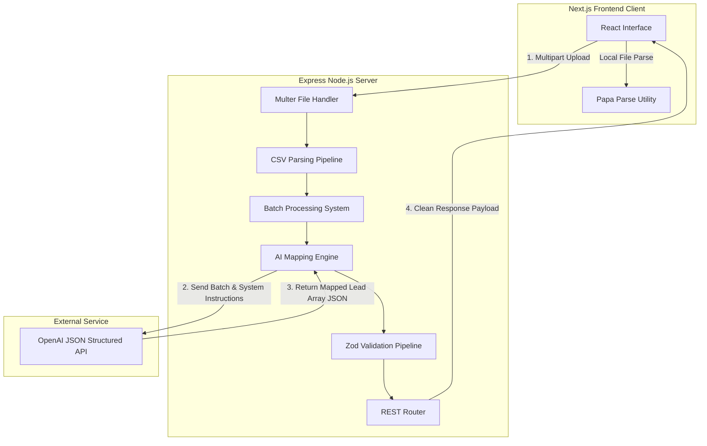
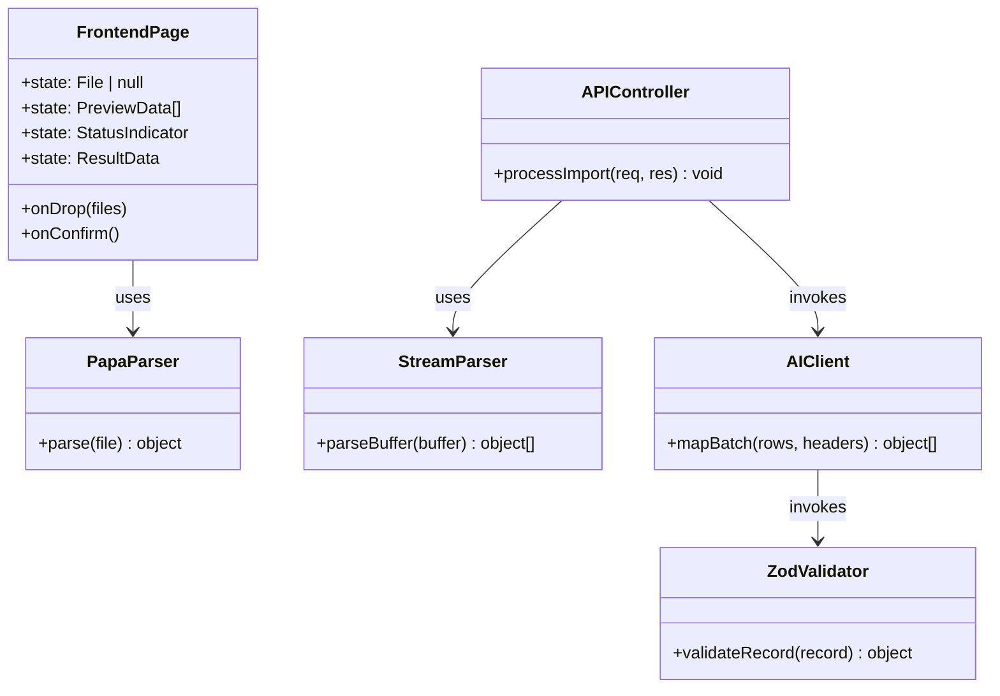
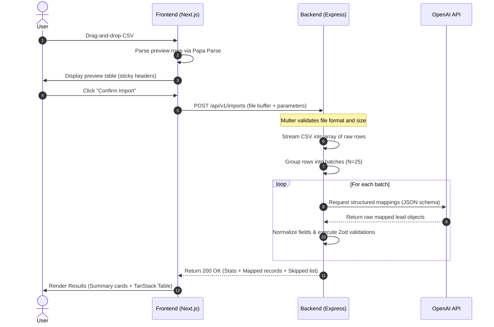
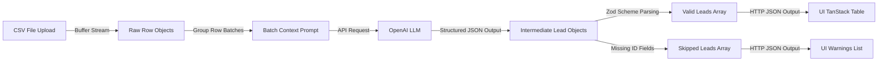
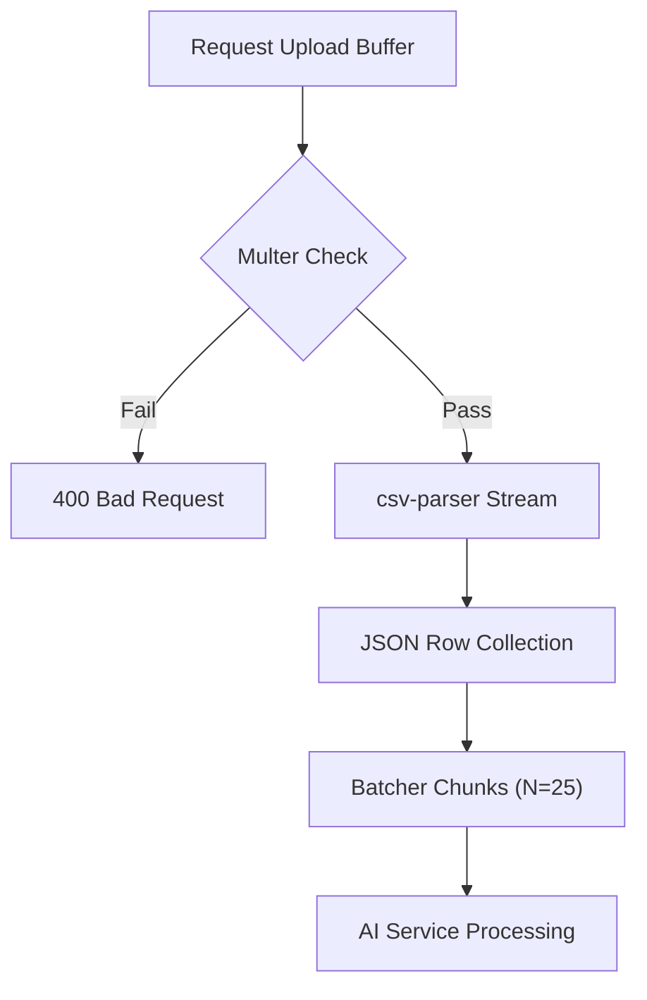
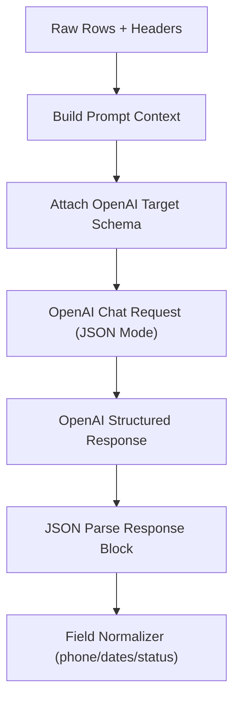
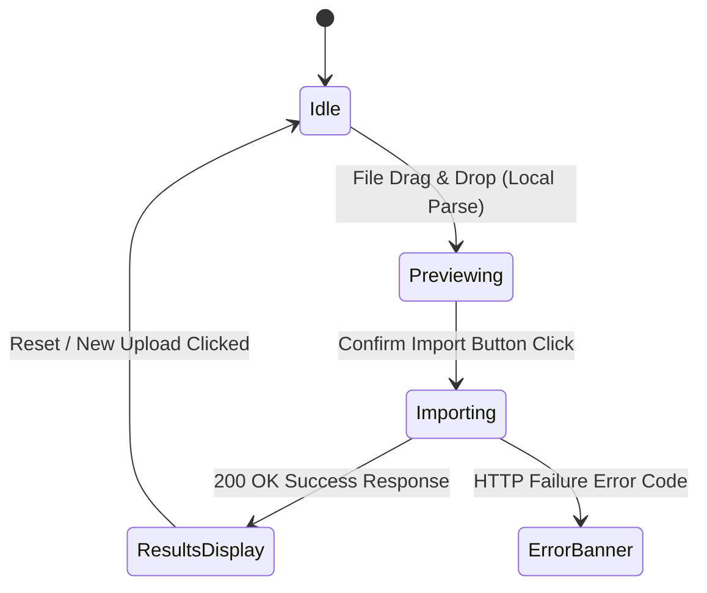
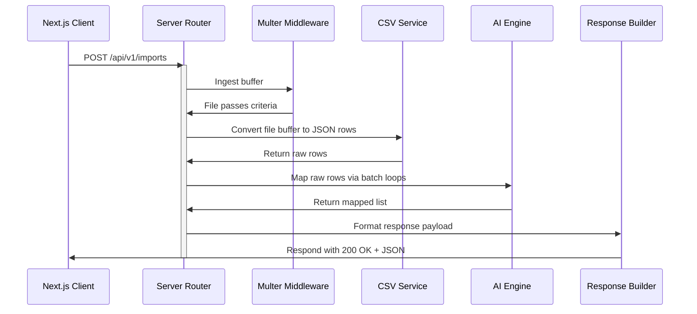
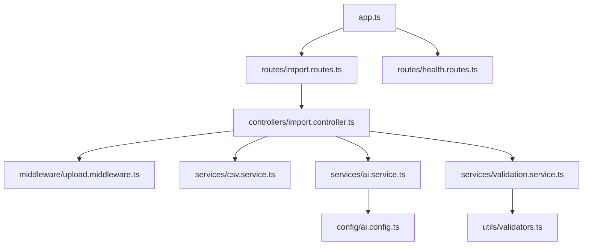
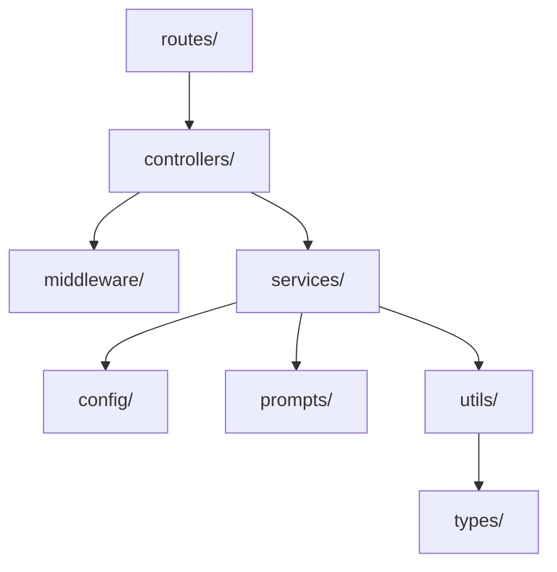

# Software Requirements Specification (SRS)

## Project Title
**GrowEasy AI-Powered CSV CRM Importer**

---

## 1. Document Control & Metadata
- **Version**: 1.1.0
- **Status**: Approved for Implementation
- **Author**: Lead Software Architect & Technical Product Manager
- **Date**: July 10, 2026

---

## 2. Project Overview
The **GrowEasy AI-Powered CSV CRM Importer** is a web-based, full-stack, stateless application. It allows sales and marketing operators to upload lead exports from arbitrary platforms (e.g., Facebook Lead Ads, Google Ads, Excel sheets, Real Estate portals) without needing to align column headers manually. 

An AI-driven layer maps arbitrary headers to standardized GrowEasy CRM field structures, performs data clean-up, and returns standardized records to the client immediately. The entire lifecycle is stateless—the system stores no records to a database, requiring no user accounts or persistent storage layers.

---

## 3. System Terminology Standard
To prevent technical inconsistencies during development, the following definitions are enforced:
- **Upload File**: The client-side action of sending a raw CSV file to the backend via multi-part form data.
- **Parse CSV**: The server-side extraction of raw lines into structured key-value dictionaries.
- **AI Extraction**: The LLM-driven process of mapping arbitrary keys and formatting row values into standard fields.
- **Validate Schema**: Executing Zod schema rules on mapped records to filter out invalid entities.
- **Import Results**: The consolidated response returned to the frontend showing the count of successfully processed, skipped, and raw records.

---

## 4. Required User Flow
The import workflow follows a strict sequence:

```mermaid
graph TD
    A["1. Landing Page (File Input)"] -->|File Dropped / Validated| B["2. Local Preview (Papa Parse)"]
    B -->|User Clicks Confirm Import| C["3. POST /api/v1/imports"]
    C -->|Multer Limits Checked| D["4. Stream Parsing (csv-parser)"]
    D -->|Row Chunking (Size = 25)| E["5. AI Extraction (OpenAI API)"]
    E -->|JSON Output Parse| F["6. Zod Schema Verification"]
    F -->|Filter Invalid Rows| G["7. Record Consolidation"]
    G -->|200 OK Response| H["8. Display Results & Summary"]
```

---

## 5. System Architecture & Component Diagrams

### 5.1 High-Level Architecture
A decoupled client-server architecture. The server interacts with OpenAI to map data:



### 5.2 Component Diagram



### 5.3 Sequence Diagram



### 5.4 Data Flow Diagram



### 5.5 Backend Processing Pipeline



### 5.6 AI Processing Pipeline



### 5.7 Frontend State Flow



### 5.8 Request Lifecycle



### 5.9 Module Dependency Diagram



### 5.10 Folder Dependency Diagram



---

## 6. AI Mapping Architecture & Prompt Engineering

### 6.1 Prompt Builder
The prompt builder constructs requests sequentially:
1. **System Prompt**: Set system-level contexts, mappings, normalizations, and schema output boundaries.
2. **Context Schema Injection**: Enforce OpenAI structured JSON mapping schema.
3. **User Prompt Payload**: Build raw records context.

#### Prompt Variables
- `headers`: Array of parsed raw CSV column headers. E.g., `["Client Email", "Tel Num", "Customer Name"]`.
- `rows`: Array of raw row objects. E.g., `[{"Client Email": "john@example.com", "Tel Num": "919876543210", "Customer Name": "John"}]`.
- `default_data_source`: Fallback value for `data_source` if unmapped.
- `default_lead_owner`: Fallback value for `lead_owner` if unmapped.

### 6.2 System Prompt Template
```markdown
You are an expert CRM Data Mapping Agent. Your role is to parse a batch of raw records from a CSV file with arbitrary, unknown column headers and map the values to a strict CRM target schema.

### TARGET CRM SCHEMA FIELDS:
1. name (concatenated full name if split in source)
2. email (primary email string)
3. country_code (numeric string, e.g., "1", "91", "44")
4. mobile_without_country_code (numeric string representing number without country code)
5. company (company or organization name)
6. city
7. state
8. country
9. lead_owner (assigned operator name)
10. crm_status (Must be EXACTLY one of: GOOD_LEAD_FOLLOW_UP, DID_NOT_CONNECT, BAD_LEAD, SALE_DONE)
11. crm_note (any extra info not mapped elsewhere)
12. data_source (Must be EXACTLY one of: leads_on_demand, meridian_tower, eden_park, varah_swamy, sarjapur_plots)
13. possession_time (possession timeline or requirements)
14. description (combined text notes and residual values)

### GENERAL MAPPING & EXTRACTION RULES:
- NEVER invent or synthesize data. If a field is not present in the input raw record, set it to null. Do NOT create emails or fake phone numbers.
- If a record does not contain any email AND does not contain any phone number, map as much as possible but mark it to be filtered. (The backend will skip records lacking both).
- If multiple email columns exist (e.g., "Primary Email", "Work Email") or a column contains multiple emails separated by commas, assign the first valid email to the 'email' field. Format any additional emails as "Alternative Email: [email]" and append them to 'crm_note'.
- If multiple phone columns exist, map the first valid phone number to 'mobile_without_country_code' and extract its country code to 'country_code'. Format additional phone numbers and place them into 'crm_note'.
- If a column contains split names (e.g., "First Name" and "Last Name"), concatenate them into the 'name' field with a single space.
- Normalize status columns: Map semantic values (e.g., "interested", "callback" to GOOD_LEAD_FOLLOW_UP; "no answer", "invalid number", "disconnected" to DID_NOT_CONNECT; "wrong number", "spam", "junk" to BAD_LEAD; "converted", "won", "closed" to SALE_DONE).
- Normalize data source columns: Map semantic values to the closest permitted data_source enum.
- Clean dates: Parse any source date value into ISO 8601 offset format (YYYY-MM-DDTHH:mm:ss.sssZ). If parsing fails, fall back to null.
- Preserve useful notes: Combine any unmapped raw columns that contain text comments or custom data into a single string for 'description'.
```

### 6.3 User Prompt Template
```json
{
  "default_metadata": {
    "default_lead_owner": "{{default_lead_owner}}",
    "default_data_source": "{{default_data_source}}"
  },
  "raw_csv_headers": {{headers}},
  "batch_records": {{rows}}
}
```

### 6.4 Structured Output JSON Schema
To guarantee output structural integrity, the OpenAI call must enforce standard JSON Schemas:

```json
{
  "type": "object",
  "properties": {
    "records": {
      "type": "array",
      "items": {
        "type": "object",
        "properties": {
          "name": { "type": ["string", "null"] },
          "email": { "type": ["string", "null"] },
          "country_code": { "type": ["string", "null"] },
          "mobile_without_country_code": { "type": ["string", "null"] },
          "company": { "type": ["string", "null"] },
          "city": { "type": ["string", "null"] },
          "state": { "type": ["string", "null"] },
          "country": { "type": ["string", "null"] },
          "lead_owner": { "type": ["string", "null"] },
          "crm_status": { 
            "type": "string",
            "enum": ["GOOD_LEAD_FOLLOW_UP", "DID_NOT_CONNECT", "BAD_LEAD", "SALE_DONE"]
          },
          "crm_note": { "type": ["string", "null"] },
          "data_source": { 
            "type": "string",
            "enum": ["leads_on_demand", "meridian_tower", "eden_park", "varah_swamy", "sarjapur_plots"]
          },
          "possession_time": { "type": ["string", "null"] },
          "description": { "type": ["string", "null"] }
        },
        "required": [
          "name", "email", "country_code", "mobile_without_country_code", "company",
          "city", "state", "country", "lead_owner", "crm_status", "crm_note",
          "data_source", "possession_time", "description"
        ],
        "additionalProperties": false
      }
    }
  },
  "required": ["records"],
  "additionalProperties": false
}
```

### 6.5 Token Management, Rate Limits & Batching
- **Batch Size (N=25)**: Chosen to optimize payload sizing. A 25-row input chunk consumes approximately 1,500 prompt tokens and returns roughly 2,000 output tokens.
- **Concurrency Rate**: To prevent hitting standard TPM/RPM boundaries on OpenAI, the backend processes chunks with a maximum concurrency limit of 3 concurrent requests.
- **Retry Mechanism**: Transient failures (429 Rate Limits, 503 Server Overload) are caught and handled by an exponential backoff scheduler. 
  - Max retries: 3.
  - Wait schedule: $Base \times 2^{Attempt}$ (1.5 seconds base delay).

---

## 7. Field-by-Field Mapping & Transformation Directory

This section lists the mapping requirements and behaviors for each target field in the GrowEasy CRM schema.

### 7.1 created_at
- **Purpose**: Tracks the import timestamp.
- **Synonyms**: `Created Date`, `Timestamp`, `Date Added`, `Submited_At`.
- **Transformation & Normalization**: Format string as ISO 8601 offset (`YYYY-MM-DDTHH:mm:ss.sssZ`). If not readable, default to the current system date and time.
- **Validation**: Must conform to a valid ISO-8601 string.
- **Fallback**: System time string (e.g. `2026-07-10T07:11:03.000Z`).
- **Example**: `"July 10, 2026 12:44 PM"` $\rightarrow$ `"2026-07-10T07:14:00.000Z"`.

### 7.2 name
- **Purpose**: Full name of the contact.
- **Synonyms**: `Lead Name`, `Full Name`, `Customer`, `First Name & Last Name`, `Client`, `Contact Person`, `Buyer Name`.
- **Transformation & Normalization**: Strip whitespaces. If the source file splits name entries across two columns (e.g., `First Name` and `Last Name`), concatenate them with a single space.
- **Validation**: Max length of 255 characters.
- **Fallback**: `null`.
- **Example**: `First: "John"`, `Last: "Smith"` $\rightarrow$ `"John Smith"`.

### 7.3 email
- **Purpose**: Contact's email address.
- **Synonyms**: `E-mail ID`, `Client Mail`, `Contact Email`, `Email Address`, `Customer Email`.
- **Transformation & Normalization**: Convert string characters to lowercase and strip surrounding whitespace. If the row contains multiple emails (e.g. `first@test.com, second@test.com`), pick the first valid email. Append alternative email strings to `crm_note` formatted as `"Alternative Email: [email]"`.
- **Validation**: Must pass email regex formatting verification.
- **Fallback**: `null`.
- **Example**: `" John.doe@Example.com "` $\rightarrow$ `"john.doe@example.com"`.

### 7.4 country_code
- **Purpose**: Country telephone dialing prefix (without the `+` sign).
- **Synonyms**: `Dialing Code`, `Country Prefix`, `Intl Code`.
- **Transformation & Normalization**: Strip spaces, non-numeric characters, and the `+` character.
- **Validation**: Must be a numeric string between 1 and 4 digits.
- **Fallback**: `null` (or infer if country column contains clear mappings, e.g. `"India"` $\rightarrow$ `"91"`).
- **Example**: `"+91 (India)"` $\rightarrow$ `"91"`.

### 7.5 mobile_without_country_code
- **Purpose**: Contact's phone number without country dialing prefix.
- **Synonyms**: `Phone`, `Mobile Number`, `Cell`, `Tel No`, `Contact Num`, `Ph No.`, `Num`.
- **Transformation & Normalization**: Remove all non-numeric characters (hyphens, spaces, brackets, `+`). Identify if a country prefix is attached. Strip the prefix if present.
- **Validation**: Must be a numeric string between 6 and 15 digits.
- **Fallback**: `null`.
- **Example**: `"+91 98765-43210"` $\rightarrow$ `"9876543210"`.

### 7.6 company
- **Purpose**: Workplace or business organization associated with the lead.
- **Synonyms**: `Organization`, `Employer`, `Business Name`, `Company Title`.
- **Transformation & Normalization**: Strip surrounding whitespaces.
- **Validation**: Max length of 255 characters.
- **Fallback**: `null`.
- **Example**: `"  GrowEasy AI  "` $\rightarrow$ `"GrowEasy AI"`.

### 7.7 city
- **Purpose**: City component of the contact address.
- **Synonyms**: `Town`, `City Address`, `Location`.
- **Transformation & Normalization**: Strip whitespaces, capitalize major letters.
- **Validation**: Max length of 100 characters.
- **Fallback**: `null`.
- **Example**: `"new york"` $\rightarrow$ `"New York"`.

### 7.8 state
- **Purpose**: State, province, or region name.
- **Synonyms**: `Province`, `Region`, `State Territory`.
- **Transformation & Normalization**: Strip whitespaces, capitalize major letters.
- **Validation**: Max length of 100 characters.
- **Fallback**: `null`.
- **Example**: `"karnataka"` $\rightarrow$ `"Karnataka"`.

### 7.9 country
- **Purpose**: Country component of the address.
- **Synonyms**: `Nation`, `Country Location`.
- **Transformation & Normalization**: Normalize spelling (e.g. `"USA"`, `"US"` $\rightarrow$ `"United States"`).
- **Validation**: Max length of 100 characters.
- **Fallback**: `null`.
- **Example**: `"United Kingdom"` $\rightarrow$ `"United Kingdom"`.

### 7.10 lead_owner
- **Purpose**: Operator or sales agent assigned to track the lead.
- **Synonyms**: `Agent Name`, `Assigned To`, `Representative`, `Sales Owner`.
- **Transformation & Normalization**: Assign the matching representative name if found in the row. If missing, fall back to the default parameter provided in the request parameters.
- **Validation**: Max length of 255 characters.
- **Fallback**: `default_lead_owner` parameter value.
- **Example**: `null` (with default parameter `"Sarah Connor"`) $\rightarrow$ `"Sarah Connor"`.

### 7.11 crm_status
- **Purpose**: The current pipeline state of the lead.
- **Synonyms**: `Lead Stage`, `Status`, `Conversion Outcome`.
- **Transformation & Normalization**: Map semantic labels to one of the four allowed enums:
  - `"interested"`, `"callback"`, `"contacted"` $\rightarrow$ `"GOOD_LEAD_FOLLOW_UP"`
  - `"no answer"`, `"invalid number"`, `"no contact"` $\rightarrow$ `"DID_NOT_CONNECT"`
  - `"wrong number"`, `"junk"`, `"spam"`, `"bad"` $\rightarrow$ `"BAD_LEAD"`
  - `"converted"`, `"won"`, `"closed deal"` $\rightarrow$ `"SALE_DONE"`
- **Validation**: Must match one of: `GOOD_LEAD_FOLLOW_UP`, `DID_NOT_CONNECT`, `BAD_LEAD`, `SALE_DONE`.
- **Fallback**: `"GOOD_LEAD_FOLLOW_UP"`.
- **Example**: `"hot lead"` $\rightarrow$ `"GOOD_LEAD_FOLLOW_UP"`.

### 7.12 crm_note
- **Purpose**: Contains secondary details or raw metadata elements.
- **Synonyms**: `Extra Details`, `Alternative Info`.
- **Transformation & Normalization**: Combine unmapped contact details (alternative emails, secondary phone numbers, labels).
- **Validation**: Max length of 1000 characters.
- **Fallback**: `null`.
- **Example**: Alternative email found: `"alt@test.com"` $\rightarrow$ `"Alternative Email: alt@test.com"`.

### 7.13 data_source
- **Purpose**: The marketing campaign origin identifier.
- **Synonyms**: `Campaign Name`, `Source Platform`, `Upload Origin`.
- **Transformation & Normalization**: Map keywords to one of the five allowed enums:
  - `leads_on_demand`, `meridian_tower`, `eden_park`, `varah_swamy`, `sarjapur_plots`.
- **Validation**: Must match one of the five permitted enums.
- **Fallback**: `default_data_source` parameter.
- **Example**: `"Facebook Leads Eden"` $\rightarrow$ `"eden_park"`.

### 7.14 possession_time
- **Purpose**: Project purchase possession timeline request.
- **Synonyms**: `Timeline`, `Ready Date`, `Requirement Date`.
- **Transformation & Normalization**: Clean up text strings.
- **Validation**: Max length of 255 characters.
- **Fallback**: `null`.
- **Example**: `"Within 6mos"` $\rightarrow$ `"Within 6 months"`.

### 7.15 description
- **Purpose**: Descriptive user remarks or comment logs.
- **Synonyms**: `Comments`, `Notes`, `Remarks`, `Lead Details`.
- **Transformation & Normalization**: Combine all remaining text columns that do not map to schema fields.
- **Validation**: Max length of 4000 characters.
- **Fallback**: `null`.
- **Example**: `"Wants 3BHK flat near central park. Budget is 1.5Cr."`.

---

## 8. Multi-Stage Validation Pipeline

To ensure the integrity of the data returned by the system, files and records must flow through a structured validation pipeline:

```
[Uploaded CSV]
      │
      ▼
┌──────────────┐
│   Stage 1    │  File Validation (Extension/Size Checks)
└──────┬───────┘
       │
       ▼
┌──────────────┐
│   Stage 2    │  CSV Validation (Delimiter Parsing verification)
└──────┬───────┘
       │
       ▼
┌──────────────┐
│   Stage 3    │  Header Validation (Check headers list)
└──────┬───────┘
       │
       ▼
┌──────────────┐
│   Stage 4    │  Row Validation (Exclude empty rows)
└──────┬───────┘
       │
       ▼
┌──────────────┐
│   Stage 5    │  AI Response Validation (Structured Output JSON Check)
└──────┬───────┘
       │
       ▼
┌──────────────┐
│   Stage 6    │  CRM Schema Validation (Zod Field Mapping Check)
└──────┬───────┘
       │
       ▼
┌──────────────┐
│   Stage 7    │  Final Response Validation (Match JSON Schema)
└──────┬───────┘
       │
       ▼
[Standardized Response]
```

### 8.1 Stage 1: File Validation
- **Action**: Handled on-upload by the backend middleware (`multer`).
- **Rules**:
  - File MIME type must match `text/csv`.
  - File name extension must end in `.csv`.
  - File size must be less than or equal to 10MB.
- **Failure**: Returns `400 Bad Request` with `INVALID_FILE_FORMAT` or `FILE_TOO_LARGE`.

### 8.2 Stage 2: CSV Validation
- **Action**: Stream parse verification.
- **Rules**:
  - Delimiter must be autodetected or resolve to `,` or `;`.
  - Every row must contain matching columns. Uneven lines (corrupted CSV formats) must throw an error.
- **Failure**: Returns `422 Unprocessable Entity` with code `MALFORMED_CSV`.

### 8.3 Stage 3: Header Validation
- **Action**: Check headers parsed from the first row of the CSV.
- **Rules**:
  - Header list must not be empty.
  - Completely blank header columns (e.g. `,"",`) are removed.
- **Failure**: Returns `400 Bad Request` with `MISSING_HEADERS`.

### 8.4 Stage 4: Row Validation
- **Action**: In-memory inspection of rows before processing.
- **Rules**:
  - Completely empty rows containing only delimiters are stripped out to save token costs.
- **Failure**: No API failure. Rows are silently discarded.

### 8.5 Stage 5: AI Response Validation
- **Action**: Inspect JSON returned by OpenAI chat completion.
- **Rules**:
  - AI response must parse as a valid JSON object.
  - JSON object must contain an array matching key `"records"`.
- **Failure**: Triggers a retry. If retries fail, records in that batch are marked as skipped with reason `AI_JSON_PARSE_FAILURE`.

### 8.6 Stage 6: CRM Schema Validation
- **Action**: Zod Schema executor maps over AI response records.
- **Rules**:
  - Execute Zod validation on each record.
  - Filter out records that lack BOTH an email address and a mobile number.
  - Valid leads are sent to the `records` success list.
  - Leads that fail checks are sent to the `skipped` list with a detailed reason.
- **Failure**: Affected records are redirected to the `skipped` collection.

### 8.7 Stage 7: Final Response Validation
- **Action**: Validate response before sending to client.
- **Rules**:
  - Response object must conform strictly to the standard HTTP schema interface:
    `{ success: boolean, metadata: { total: number, imported: number, skipped: number }, records: Lead[], skipped: SkippedLead[] }`.
- **Failure**: Returns `500 Internal Server Error` with code `RESPONSE_VALIDATION_FAILED`.

---

## 9. Frontend Architecture

### 9.1 Application Pages
- **Landing / Upload Page**: Default view. Contains the Drag-and-Drop file zone, option dropdowns for default properties, and application instructions.
- **Preview View**: Renders once a file is parsed locally. Contains the sticky-header preview table and the "Confirm Import" action button.
- **Importing Loader View**: Renders during backend network execution. Contains progress indicators and message carousels.
- **Results View**: Renders upon successful API resolution. Displays metric stats cards, the searchable TanStack table of imported leads, and the warnings list.

### 9.2 Component Tree
```
AppLayout
  ├── Header (Brand Identity)
  ├── PageContainer
  │     ├── UploadCard (Drag & Drop Zone / File Picker)
  │     ├── ImportParamsForm (Default owner / Default source dropdowns)
  │     ├── PreviewTable (Sticky header table / Local Papa Parse preview)
  │     ├── ProgressOverlay (Progress state indicators)
  │     └── ResultsDashboard
  │           ├── SummaryStats (Cards for Imported, Skipped, Total metrics)
  │           ├── SearchFilterPanel (Global query inputs)
  │           ├── TanStackTable (CRM Success records)
  │           └── SkippedList (Detailed warnings and reasons)
  └── Footer
```

### 9.3 State Management Blueprint
Single page state object managed in React via custom hook `useCSVImport`:

```typescript
interface ImportState {
  step: 'IDLE' | 'PREVIEW' | 'IMPORTING' | 'RESULTS' | 'ERROR';
  file: File | null;
  previewRows: string[][];
  previewHeaders: string[];
  defaultLeadOwner: string;
  defaultDataSource: string;
  importProgress: number;
  results: {
    total: number;
    imported: number;
    skipped: number;
    records: any[];
    skippedRecords: any[];
  } | null;
  error: {
    code: string;
    message: string;
  } | null;
}
```

### 9.4 State View Guidelines

| Page State | UI Component Layout | Interaction States | Action Buttons |
| :--- | :--- | :--- | :--- |
| **`IDLE`** | DragDropZone, ImportParamsForm | Ready for drag & drop or file selection. | None |
| **`PREVIEW`** | PreviewTable, ImportParamsForm | Renders top 10 raw rows, scrollable horizontally. | "Confirm Import", "Cancel" |
| **`IMPORTING`**| ProgressOverlay, Spinner | Shows active upload and processing progress. | None (disabled interface) |
| **`RESULTS`** | ResultsDashboard (Summary cards, TanStackTable, SkippedList) | Fully interactive, searchable, paginated. | "Import New File" (reset) |
| **`ERROR`** | AlertBanner | Red warning layout with detailed error info. | "Try Again" (returns to IDLE) |

---

## 10. Backend Architecture

### 10.1 Module Responsibilities
- **`app.ts`**: Express application shell, CORS configurations, security middlewares (helmet, rate limits).
- **`server.ts`**: Standard cluster execution handler, listens on targeted ports, handles graceful shutdowns (SIGTERM).
- **`routes/import.routes.ts`**: Binds `POST /api/v1/imports` to `Multer` buffers and coordinates execution with controllers.
- **`controllers/import.controller.ts`**: Orchestrates CSV stream parsing, batches rows, invokes mapping services, and structures HTTP responses.
- **`services/csv.service.ts`**: Ingests buffer streams, parses headers and lines via `csv-parser`, and returns raw JSON rows.
- **`services/ai.service.ts`**: Builds chat requests, manages batching loops, communicates with OpenAI, and parses JSON output.
- **`services/validation.service.ts`**: Maps records against Zod schemas and partitions records into success and skipped arrays.

### 10.2 Request & Response Lifecycles

```
[Client POST /api/v1/imports] 
         │
         ▼ (Cors check, Express body parsing)
[Router Middleware Pipeline]
         │
         ▼ (Multer checks type: text/csv, size <= 10MB)
[Multer Upload Filter]
         │
         ▼ (Binds file buffer to request payload)
[Controller - processImport]
         │
         ▼ (csv-parser converts buffer stream to JSON rows array)
[CSV Service - parseStream]
         │
         ▼ (Chunks rows into N=25 batches)
[AI Service - mapBatch] 
         │
         ▼ (Sends instruction prompts to OpenAI model API)
[OpenAI API Call]
         │
         ▼ (Receives JSON array back)
[Validation Service - validate]
         │
         ▼ (Separates leads based on Zod rules)
[Zod Schema Check]
         │
         ▼ (Constructs final HTTP response payload)
[Controller Formatter]
         │
         ▼ (Sends 200 OK with clean payload)
[Client Response JSON]
```

---

## 11. API Endpoint Details

### 11.1 `GET /api/v1/health`
- **Purpose**: Health check endpoint to monitor server status and external dependency connectivity.
- **Headers**:
  - `Accept: application/json`
- **Response**:
  - **`200 OK`**: System is online and healthy.
    ```json
    {
      "status": "healthy",
      "timestamp": "2026-07-10T07:11:03.000Z",
      "dependencies": {
        "openai_api": "healthy"
      }
    }
    ```
  - **`500 Internal Server Error`**: Outage on dependency or internal error.
    ```json
    {
      "status": "unhealthy",
      "timestamp": "2026-07-10T07:11:03.000Z",
      "error": "OpenAI API connection failed"
    }
    ```

### 11.2 `POST /api/v1/imports`
- **Purpose**: Uploads raw CSV file, maps columns via AI, validates fields, and generates standardized CRM records.
- **Headers**:
  - `Content-Type: multipart/form-data`
- **Request Parameters**:
  - `file` (Binary stream, Required): Valid CSV file, max size 10MB.
  - `default_data_source` (String, Optional): Fallback campaign source identifier. Must be a valid source enum.
  - `default_lead_owner` (String, Optional): Fallback owner name string.
- **Response Schemas**:
  - **`200 OK`**: Processed successfully.
    ```json
    {
      "success": true,
      "metadata": {
        "total_records": 2,
        "imported_records": 1,
        "skipped_records": 1
      },
      "records": [
        {
          "created_at": "2026-07-10T07:11:03.000Z",
          "name": "Bruce Wayne",
          "email": "bruce@waynecorp.com",
          "country_code": "1",
          "mobile_without_country_code": "5550199",
          "company": "Wayne Enterprises",
          "city": "Gotham",
          "state": "New Jersey",
          "country": "United States",
          "lead_owner": "Sarah Connor",
          "crm_status": "GOOD_LEAD_FOLLOW_UP",
          "crm_note": "Interested in downtown land.",
          "data_source": "leads_on_demand",
          "possession_time": "Immediate",
          "description": "High net-worth buyer."
        }
      ],
      "skipped": [
        {
          "row_index": 2,
          "raw_data": {
            "First Name": "Unknown Contact",
            "Notes": "No contact information provided."
          },
          "reason": "Missing both email and phone number columns."
        }
      ]
    }
    ```
  - **`400 Bad Request`**: Upload or validation parameter failed.
    ```json
    {
      "success": false,
      "error": {
        "code": "FILE_UPLOAD_ERROR",
        "message": "No file uploaded or file format is invalid.",
        "timestamp": "2026-07-10T07:11:03.000Z"
      }
    }
    ```
  - **`422 Unprocessable Entity`**: Corrupted file could not be parsed.
    ```json
    {
      "success": false,
      "error": {
        "code": "MALFORMED_CSV",
        "message": "CSV formatting is corrupt. Delimiters could not be parsed.",
        "timestamp": "2026-07-10T07:11:03.000Z"
      }
    }
    ```
  - **`502 Bad Gateway`**: OpenAI API failure.
    ```json
    {
      "success": false,
      "error": {
        "code": "AI_SERVICE_UNAVAILABLE",
        "message": "The AI mapping engine was unable to process mapping arrays.",
        "timestamp": "2026-07-10T07:11:03.000Z"
      }
    }
    ```

---

## 12. Error Handling & Recovery Strategies

The application handles standard failure scenarios using the following recovery blueprint:

| Error Case | Origin | HTTP Code / UI Action | Recovery Strategy |
| :--- | :--- | :--- | :--- |
| **Invalid File Type** | Backend Upload | `400 Bad Request` | Multer blocks execution. UI displays warning block. |
| **File Too Large (>10MB)** | Backend Upload | `400 Bad Request` | Multer limits catch buffer. Upload is rejected. |
| **Empty Upload File** | Backend Upload | `400 Bad Request` | Server checks file byte size. Rejects if `size === 0`. |
| **Malformed CSV Rows** | Backend Parser | `422 Unprocessable` | Discard individual malformed rows, continue parsing valid lines. |
| **AI Request Timeout** | OpenAI API | `502 Bad Gateway` | Exponential retry (max 3). If failure persists, skip the batch. |
| **Corrupt JSON Response** | OpenAI API | Retry Batch | Re-execute prompt once. If still corrupt, flag batch as skipped. |
| **Rate Limits (429)** | OpenAI API | Backoff scheduler | Pause execution queue for 2 seconds, retry execution batch. |
| **Zod Schema Mismatch** | Backend Validation| Record Skipped | Send the affected record to the `skipped` list. |
| **Partial Batch Failure** | Backend Validation| `200 OK` (Mixed) | Successfully map valid rows. Log failed rows as skipped. |
| **Connection Timeout** | Network | UI Error View | UI displays retry action banner to trigger request again. |
| **CORS Origin Check Fail** | Backend Router | `403 Forbidden` | Block client request. Log security mismatch on server console. |
| **Server Crash** | Backend Node | `500 Server Error` | Express catch-all returns error. PM2 system restarts service. |

---

## 13. Comprehensive Testing Strategy

### 13.1 Unit Testing Blueprint
- **CSV Stream Parser**: Verify parsing works with different delimiters (comma, semicolon), handles escaped quotes, and correctly skips empty rows.
- **Phone Normalization Utilities**: Test phone cleaning logic and date mapping to ISO 8601 formats.
- **Zod Validator**: Verify constraints on length, required formats, and custom validations (e.g. record is invalid if email and phone number are both missing).

### 13.2 Integration Testing Blueprint
- **Batch Processing Manager**: Verify that arrays of rows are correctly split into chunks of 25 and processed sequentially.
- **System Service Chain**: Mock OpenAI responses. Verify that data flows correctly: `Multer buffer` $\rightarrow$ `csv-parser` $\rightarrow$ `AI batch mapping` $\rightarrow$ `Zod validation` $\rightarrow$ `Structured Response JSON`.

### 13.3 API Testing Blueprint
- **`GET /api/v1/health`**: Test status responses.
- **`POST /api/v1/imports`**: Test endpoints using `supertest`:
  - Upload valid CSV file $\rightarrow$ expect `200 OK`.
  - Upload raw binary file $\rightarrow$ expect `400 Bad Request`.
  - Upload file size > 10MB $\rightarrow$ expect `400 Bad Request`.
  - Mock OpenAI timeout error $\rightarrow$ expect `502 Bad Gateway` (after retries exhausted).

### 13.4 AI & Prompt Verification Testing
- **Prompt Assertions**: Run test batches with predefined inputs. Verify that:
  - If email and phone number are missing, the AI output leaves them empty (to be skipped by Zod validation).
  - The AI output does not invent mock values.
  - Arbitrary status strings are correctly normalized to target enums.

### 13.5 Edge Cases & Load Testing
- **Large Dataset (250+ Rows)**: Verify system handles larger uploads by chunking and processing them in batches under the 30-second timeout limit.
- **Zero Columns/No Headers**: Verify that if a file contains only rows without headers, columns are mapped using positional indexes (`Column_0`, `Column_1`) and semantic intent is inferred.

---

## 14. Project Folder Structure & Modular Responsibilities

```
AI-powered-csv-crm-importer/
├── frontend/                     # Next.js SPA
│   ├── public/                   # Static icons & illustrations
│   ├── src/
│   │   ├── app/                  # Next.js App Router (Layouts & Providers)
│   │   ├── components/           # UI Elements (Buttons, Cards, Tables)
│   │   ├── hooks/                # Custom state hooks (useCSVImport)
│   │   ├── styles/               # CSS configurations
│   │   └── utils/                # Frontend helper utilities (Papa Parse wrapper)
│   └── package.json
│
└── backend/                      # Node.js + Express Backend
    ├── src/
    │   ├── config/               # Environment variables & OpenAI client
    │   ├── controllers/          # Endpoint controllers (orchestrate import)
    │   ├── middleware/           # File size upload boundaries & error handlers
    │   ├── routes/               # Routes mapping path endpoints
    │   ├── services/             # Core business engines (CSV, AI, Validation)
    │   ├── prompts/              # Strict system instructions
    │   ├── types/                # CRM type contracts
    │   └── utils/                # Date and phone normalization utilities
    ├── package.json
    └── Dockerfile
```

---

## 15. Deployment Plan

### 15.1 Frontend Deployment
- **Platform**: Vercel or Netlify.
- **Environment Variables**:
  - `NEXT_PUBLIC_API_URL`: The deployed backend URL (e.g. `https://api.groweasy-importer.com`).

### 15.2 Backend Deployment
- **Platform**: Containerized on AWS App Runner, GCP Cloud Run, or Render.
- **Environment Variables**:
  - `PORT`: Binding port (default `5000`).
  - `OPENAI_API_KEY`: API access key.
  - `ALLOWED_ORIGIN`: CORS restriction string (points to frontend URL).

---

## 16. Recommended README Outline

The project `README.md` must be structured as follows:

1. **Title & Project Description**: GrowEasy AI-Powered CSV CRM Importer. Explain that the application uses an LLM to map arbitrary column headers to standardized CRM fields.
2. **Architecture Diagram**: High-level system overview.
3. **Getting Started**:
   - Install dependencies in `frontend/` and `backend/`.
   - Configure environment variables.
   - Run local development servers (`npm run dev`).
4. **Environment Variables**:
   - `OPENAI_API_KEY`, `ALLOWED_ORIGIN`, `NEXT_PUBLIC_API_URL`.
5. **Docker Deployment**:
   - Run `docker-compose up --build` to start both services locally.
6. **API Routes**:
   - `GET /api/v1/health`
   - `POST /api/v1/imports` (request details, parameters, response schema).
7. **Code Folder Structure Map**: Clear map of directories and responsibilities.
8. **Testing Execution Guide**: Commands to run unit, integration, and endpoint tests.
9. **Future Improvements**:
   - Add database persistence.
   - Support parsing larger files.
   - Add batch status notifications.
